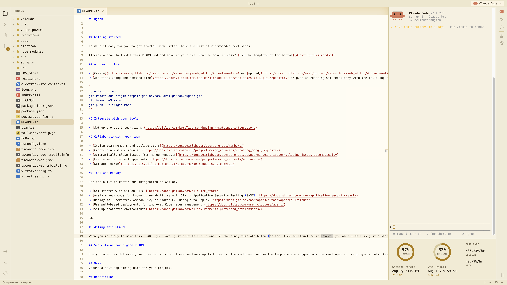
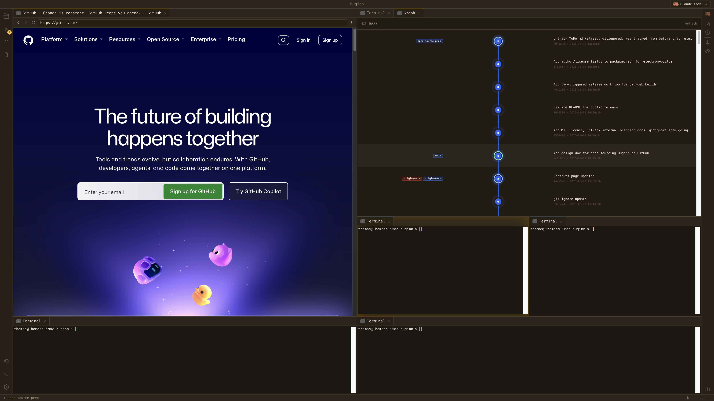
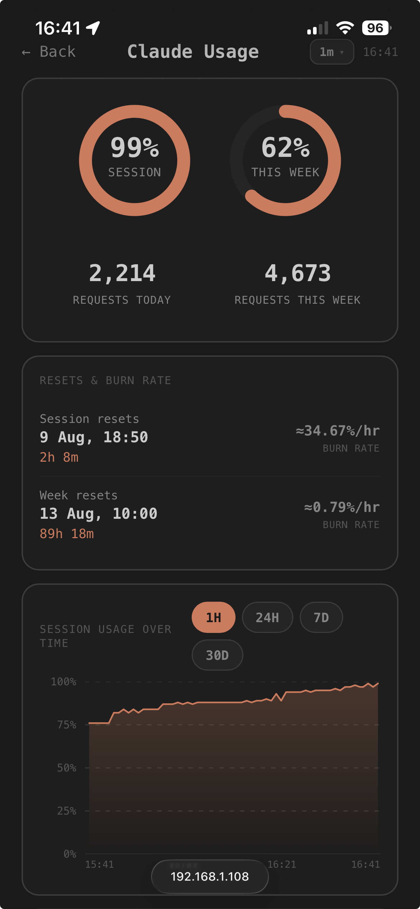

# Huginn

A Claude-native IDE — an Electron desktop app built around terminal AI
coding agents, with a full editor, git tooling, and a mobile companion
display.




> **Not affiliated with Anthropic or OpenAI.** Huginn integrates the Claude
> Code CLI and the OpenAI Codex CLI as terminal agents, and includes a panel
> for connecting to any OpenAI-compatible local LLM endpoint ("Bridge"). It
> is an independent, unofficial project — "Claude" and "Codex" are
> trademarks of their respective owners.

## What it is

Huginn wraps a Monaco-based code editor, a real terminal, and git tooling
around one or more AI coding agents running side-by-side, so you can drive
an agent and review/edit its changes in the same window instead of
switching between a browser, a terminal, and an editor.

## Features

- **Editor** — Monaco-based code editing with syntax highlighting and themes
- **Agent panels** — run Claude Code and Codex CLI as first-class panels,
  plus a "Bridge" panel for any OpenAI-compatible local LLM endpoint
- **Git panel** — log/graph view, stage & commit, push/pull, all without
  leaving the app
- **Integrated terminal** — a real shell (via `node-pty`) alongside the
  agent panels
- **Mobile Display** — pair a phone over your local network (QR code + PIN)
  to view usage stats on a second screen
- **Usage tracking** — Claude usage/burn-rate monitoring built into the
  status bar
- **Command palette & shortcuts overlay** — keyboard-first navigation

| Git graph | Mobile Display |
|---|---|
|  |  |

## Requirements

- macOS (Apple Silicon) or Linux (x86_64, Debian/Ubuntu-based) — Intel Mac
  and other Linux distros aren't supported yet
- [Claude Code CLI](https://docs.claude.com/en/docs/claude-code) and/or the
  [OpenAI Codex CLI](https://github.com/openai/codex) installed separately,
  for the agent panels you want to use — Huginn launches them, it doesn't
  bundle them

## Installation

```bash
curl -fsSL https://raw.githubusercontent.com/DarthTigerson/Huginn/main/install.sh | bash
```

This downloads the latest release and installs it — to `/Applications` on
macOS, or `~/.local/share/huginn` (with a `huginn` command symlinked into
`~/.local/bin`) on Linux.

### Manual installation

Download the latest archive for your platform from the
[Releases page](https://github.com/DarthTigerson/Huginn/releases):

- **macOS**: download `Huginn-arm64.zip`, unzip it, and drag `Huginn.app` to
  Applications. If macOS reports the app as "damaged" (a Gatekeeper quirk
  for unsigned, browser-downloaded apps — the app isn't actually damaged),
  run:
  ```bash
  xattr -cr /Applications/Huginn.app
  ```
- **Linux**: download `Huginn-x64.tar.gz` and extract it wherever you like:
  ```bash
  mkdir -p ~/.local/share/huginn
  tar -xzf Huginn-x64.tar.gz -C ~/.local/share/huginn
  ~/.local/share/huginn/huginn
  ```

### Build from source

```bash
git clone https://github.com/DarthTigerson/Huginn.git
cd Huginn
npm install
npm run dev
```

To build your own archive:

```bash
npm run dist:mac    # produces Huginn-arm64.zip under release/
npm run dist:linux  # produces Huginn-x64.tar.gz under release/
```

## Contributing

Issues and pull requests are welcome. This is an early-stage (`v0.1.0`)
project, so expect some rough edges.

## License

[MIT](LICENSE)
